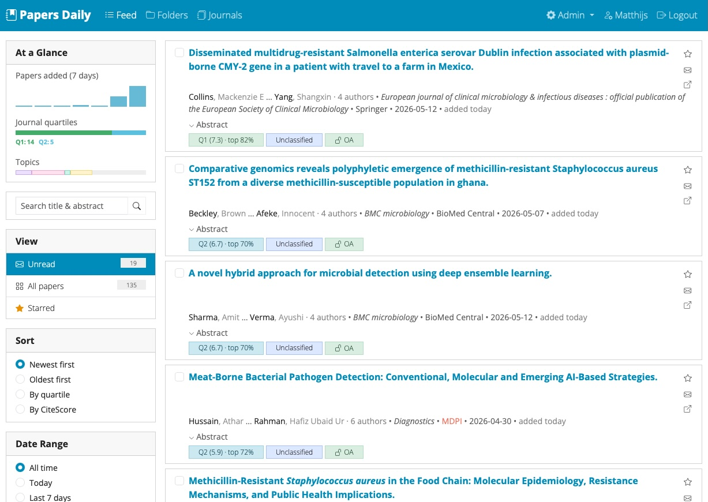
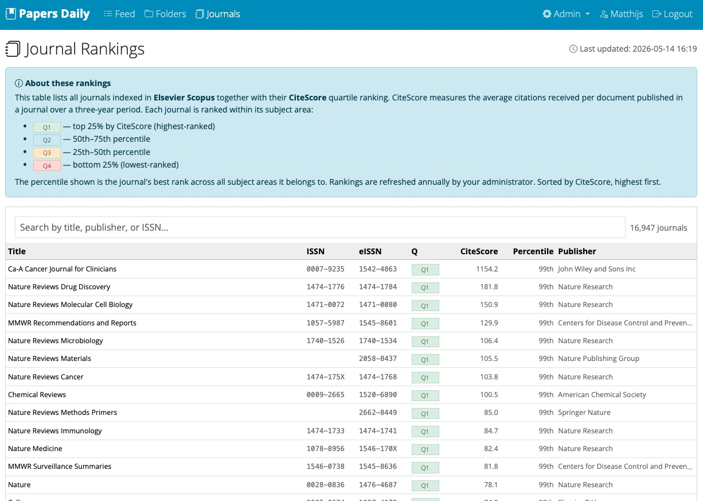
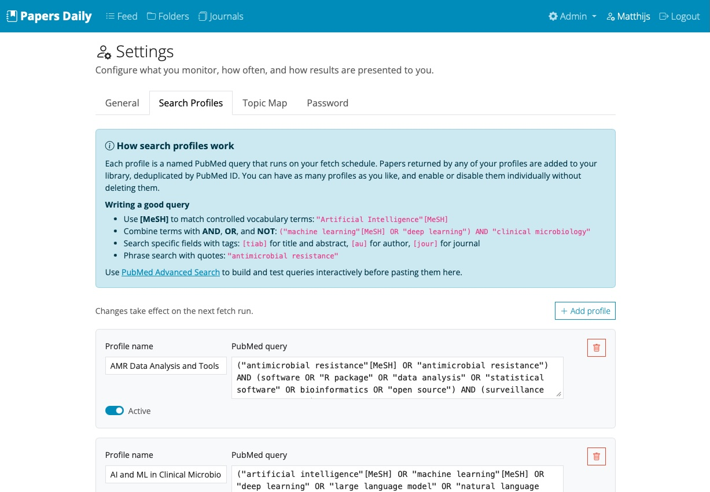
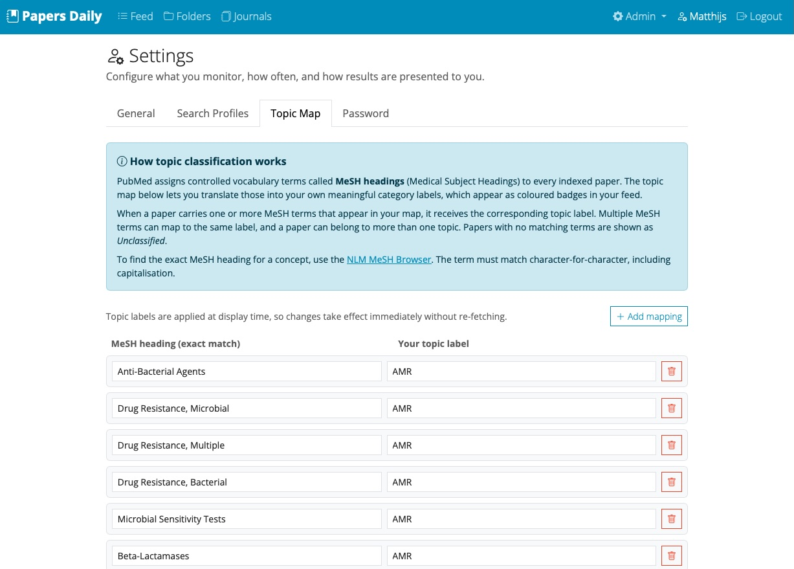
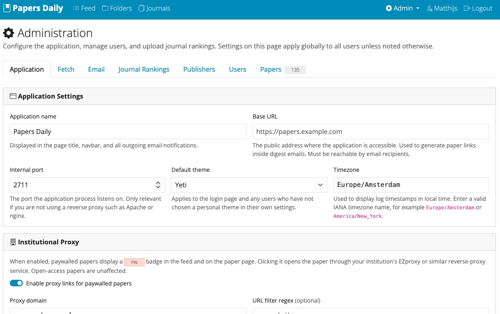

# MedPapers Daily

A self-hosted monitor for medical scientific literature. This webapp fetches papers from PubMed daily and provides:

- Daily HTML email digests per user
- Web feed for browsing, searching, and filtering papers
- Scopus journal quartile filtering (Q1–Q4)
- MeSH-based topic classification
- Starring, read/unread tracking, folders, and relevance rating
- RIS export (for EndNote and reference managers)
- Open-access links via Unpaywall and institutional proxy support
- Per-user PubMed search profiles
- Multi-user support with an admin panel

## Requirements

- Python 3.11+

Preferred:
- A free [NCBI API key](https://www.ncbi.nlm.nih.gov/account/) to increase the PubMed rate limit to 10 req/sec
- A free [Elsevier API key](https://dev.elsevier.com/) to retrieve Journal rankings
- An SMTP relay (e.g. Gmail App Password)

## Setup

```bash
# 1. Create a virtual environment and install dependencies
python3 -m venv venv
venv/bin/pip install -r requirements.txt

# 2. Create initial admin user
venv/bin/python setup_admin.py <username> <password>

# 3. Run the app
venv/bin/uvicorn app.main:app --host 127.0.0.1 --port 2711 --reload
```

> All options can be set in the app and there is never a need to edit `.yaml` files manually.

## Cron

Use Cron to fetch new papers daily, and send a per-user email digest of new papers.

```
0  6 * * * /path/to/medpapers-daily/venv/bin/python /path/to/medpapers-daily/fetch.py && /path/to/medpapers-daily/venv/bin/python /path/to/medpapers-daily/email_digest.py
# or only fetch, without email
0  6 * * * /path/to/medpapers-daily/venv/bin/python /path/to/medpapers-daily/fetch.py
```

## Deploy as a systemd service

Run MedPapers Daily as a service to keep the webserver alive. A reverse proxy is a very effective way to get the app as one of your subdomains.

```bash
cp medpapers-daily.service.example medpapers-daily.service
# Edit medpapers-daily.service: replace YOUR_USERNAME and /path/to/medpapers-daily
nano medpapers-daily.service

sudo cp medpapers-daily.service /etc/systemd/system/
sudo systemctl enable --now medpapers-daily
```

## Screenshots

### Main Screen: Feed



### Journal Rankings

These rankings can be retrieved using an API from Elsevier. Instructions are provided in the app.



### Search Profiles



### Topics (MeSH mapping)



### Admin Menu



----

This project is licensed under the [GNU General Public License v3.0](https://www.gnu.org/licenses/gpl-3.0.html).
